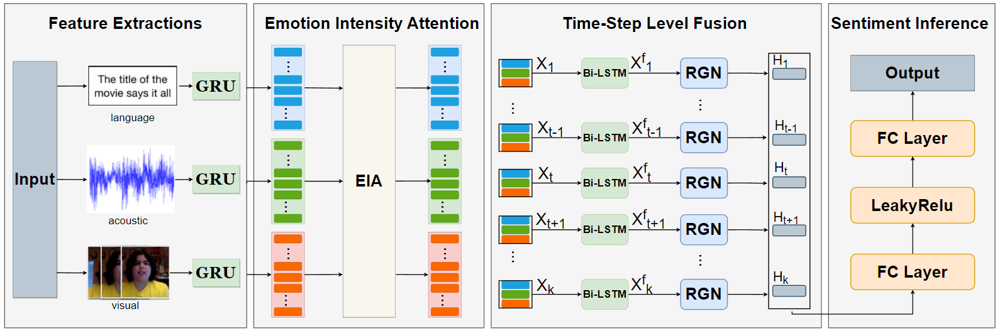

# Multimodal Sentiment Recognition with Residual Gating Network and Emotion Intensity Attention
Code for "Multimodal Sentiment Recognition with Residual Gating Network and Emotion Intensity Attention".

<p>
  
</p>

### Setup the environment

We work with a conda environment.

```
conda env create -f environment.yml
conda activate msrg
```
### Running the code
+  ```cd Model/CMU-MOSI``` View experiments on CMU-MOSI in detail.
+  ```cd Model/MOSEI_URFUNNY``` View experiments on CMU-MOSEI and UR_FUNNY in detail.
### Baseline methods
If you want to know more about experimental part, click [here](https://drive.google.com/file/d/1a8I2dRd3IPuEunoxXPVGMmcjyyu0uX88/view?usp=sharing) for details.
### Ablation
```cd Ablation``` for details.
### Contact
For any questions, please email at henumzj@henu.edu.cn
